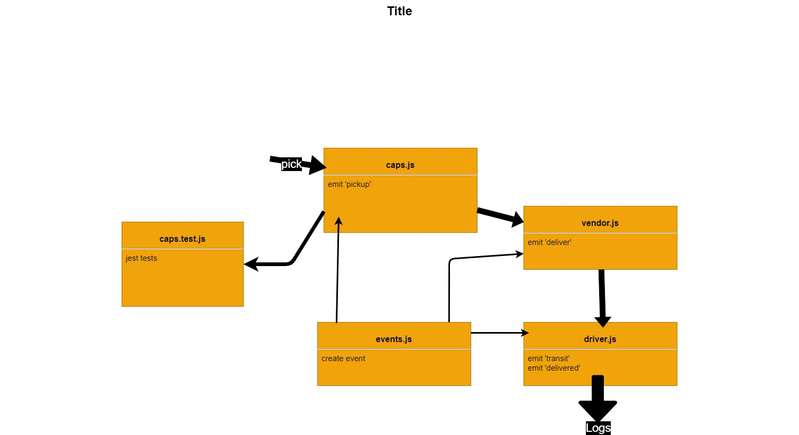

# caps

## Author : Ahmad Abu Osbeh

### Description :

- create caps-app to track the goods and log the status if each interval.

## process output

```
hello from caps
EVENT {
  event: 'pickup',
  time: '2021-07-12T12:37:37.318Z',
  payload: {
    store: "Ahmad's Store",
    orderID: 'b65fab05-0781-465e-a1ad-2b11541d74f9',
    customer: 'Kristen Kuhn',
    address: '2957 Goodwin Port'
  }
}
DRIVER: picked up ORDER_ID : b65fab05-0781-465e-a1ad-2b11541d74f9
EVENT {
  event: 'in-transit',
  time: '2021-07-12T12:37:38.325Z',
  payload: {
    store: "Ahmad's Store",
    orderID: 'b65fab05-0781-465e-a1ad-2b11541d74f9',
    customer: 'Kristen Kuhn',
    address: '2957 Goodwin Port'
  }
}
DRIVER: delivered up ORDER_ID : b65fab05-0781-465e-a1ad-2b11541d74f9
VENDOR: Thank you for delivering ORDER_ID : b65fab05-0781-465e-a1ad-2b11541d74f9
EVENT {
  event: 'delivered',
  time: '2021-07-12T12:37:41.329Z',
  payload: {
    store: "Ahmad's Store",
    orderID: 'b65fab05-0781-465e-a1ad-2b11541d74f9',
    customer: 'Kristen Kuhn',
    address: '2957 Goodwin Port'
  }
}
```

**PR Link** : [PR](https://github.com/Ahmad-AbuOsbeh/caps/pull/2)

- https://github.com/Ahmad-AbuOsbeh/caps/pull/2

# UML


